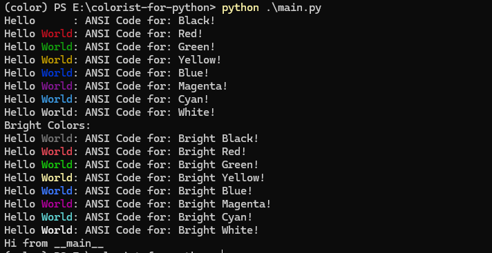
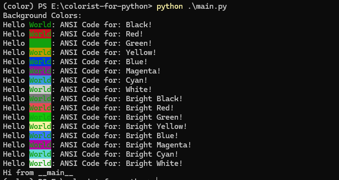

# I. What Are ANSI Escape Codes?

1. ANSI escape sequences were introduced in the 1970s as a standard for styling text terminals with color and font options
2. supported by most modern operating systems, including Windows, macOS, and Linux
3. allow you to add **colors** and **effects** to your terminal output

For example:

% I want <span style="color:red">RED</span> <span style="color:green">GREEN</span> <span style="color:blue">BLUE</span> text ...

% ... or <span style="color:red">RED</span> <span style="color:green">GREEN</span> <span style="color:blue">BLUE</span> background...

or _blinking effect_ (due to limitations of markdown rendering, you can not see it here):

# II. Building Blocks
1. Escape character: always start with `\x1b`, `\033`, `\u001b`, or `\e` or depending on the operating system or programing language. Technically this inserts byte 27 into a string, which is equavalent to `0x1b` and ESC key when you look at an ASCII table.

    |escape character|description|
    |---|---|
    |`\x1b`|hexadecimal representation of the escape character|
    |`\033`|octal representation of the escape character|
    |`\u001b`|Unicode representation of the escape character|
    |`\e`|common alias for the escape character|
    |27|decimal representation of the escape character|
the first part is called the **Control Sequence Introducer**(CSI), whichever option you use
2. Sequence parts: all ansi escape code follow same pattern. The sequence \x1b[31m can be broken down like this: 

|part|`\x1b[`| `31`                                                                                                                                        |`m`|
|---|---|---------------------------------------------------------------------------------------------------------------------------------------------|---|
|description|Control Sequence Introducer (CSI)| Color code for various text and background colors, e.g. between 30-37 or 90-97 for foreground color; 40-47 or 100-107 for background color. |Ends sequence and calls the graphics function Select Graphic Rendition (SGR).|

For example: 

| sequence   | description           |
|------------|-----------------------|
| `\x1b[31m` | Set text color to red |
| `\x1b[0m`  | reset any styling     |

Python example:

% I want <span style="color:red">RED</span> color

```python
print("I want \x1b[31mRED\x1b[0m color")
```
# 3. More example
1. You can use the following code to print text in different colors:




2. You can also use background colors:



reference: [ANSI escape code](https://en.wikipedia.org/wiki/ANSI_escape_code)

# 4. Use case

1. **Terminal applications**: Many terminal applications use ANSI escape codes to provide colorized output, such as `ls` command in Linux.
2. **Text editors**: Some text editors, like Vim and Emacs, use ANSI escape codes to highlight syntax and provide visual cues.
3. **Logging frameworks**: Many logging frameworks, such as `log4j` and `logback`, use ANSI escape codes to colorize log messages based on their severity level.
4. **Shell scripts**: Shell scripts can use ANSI escape codes to add color and formatting to their output, making it easier to read and understand.
5. **Programming languages**: Many programming languages, such as Python, Ruby, and JavaScript, have libraries or built-in support for ANSI escape codes to add color and formatting to console output.
6. **Web development**: Some web frameworks, like Flask and Django, use ANSI escape codes to colorize console output during development, making it easier to debug and understand application behavior.
